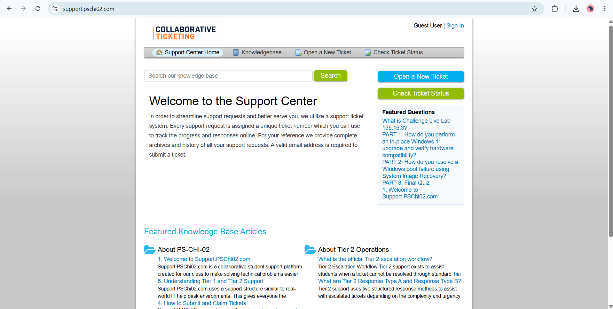

# PSChi02 Help Desk Screenshots

This folder contains screenshots documenting the development and operation of the PSChi02 Help Desk platform.

## Homepage

The public-facing support portal used by students to submit tickets, access resources, and interact with the platform.

## Agent Dashboard

Internal dashboard used by support agents to manage tickets and workflows.

## Grafana Monitoring

Monitoring dashboard used to track server performance and health metrics.

